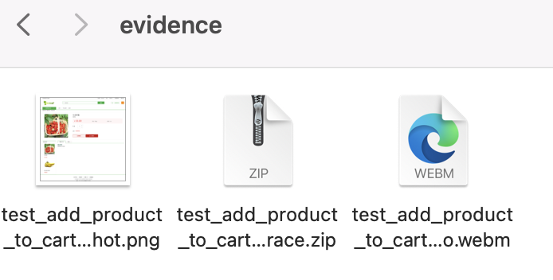
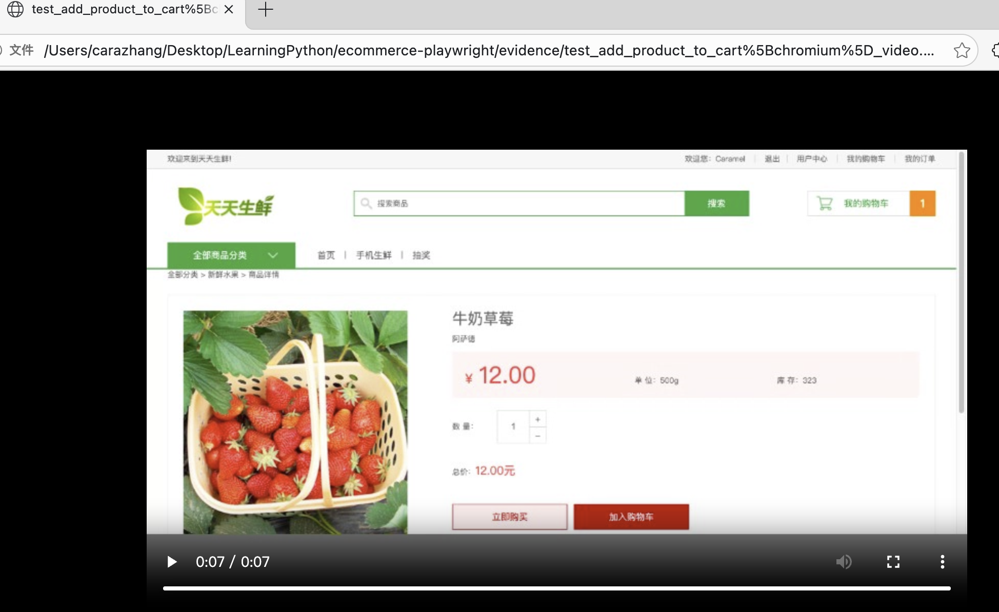
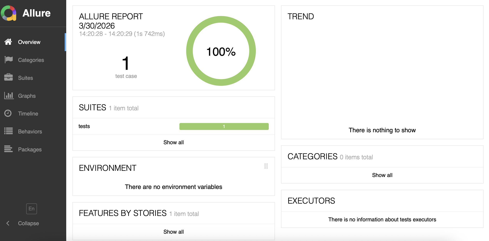
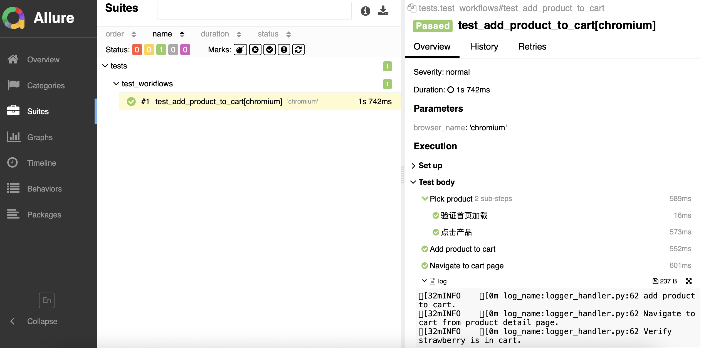

# 基于pytest-playwright的测试框架（demo-Playwright-ui-test）
> 用 Playwright + pytest 为 Django 电商系统构建的 UI 自动化测试框架

## Tech Stack
- pytest-playwright
- python 3.11.5
- allure report

## Features
- Session 复用策略（一次 UI 登录 + auth.json 共享）
- 失败自动取证（截图 + Trace + 视频录制）


- Allure 报告集成


- 多环境配置（dev/staging/prod）

## Project Structure
```
ecommerce-playwright/
├── pages/          # Page Object Model 层
├── tests/          # 测试用例
├── config/         # 多环境配置
├── utils/          # 工具类（logger等）
└── evidence/       # 失败用例证据（截图/trace/视频）
```

## Quick Start
### Prerequisites
- Python 版本 3.11
- 被测应用需先在本地启动
    - 拉取项目 daily-fresh-demo
    - 本地启动详见该项目README

### Install
```bash 
pip install -Ur requirements.txt
```
### MCP Setup（可选，用于 Claude Code 辅助调试）
```bash
cp .mcp.json.example .mcp.json
# 编辑 .mcp.json，将 filesystem 中的路径替换为本机项目绝对路径
```

### Run Common
```bash
# Run all tests
pytest
# Run a single test
pytest tests/test_workflows.py::test_add_product_to_cart -v
# Run with specific environment (dev/staging/prod)
ENV=staging pytest
# Run headless (override pytest.ini default of --headed)
pytest --headless
# View Allure report (after running tests)
allure serve ./allure-results
# Open Playwright trace viewer
playwright show-trace evidence/<test_name>_trace.zip
```

## Architecture Decision

### Session 复用策略
每次 UI 登录耗时且占资源，用例量大时尤为明显。利用 Playwright 的 `storage_state` 将首次登录的 session 保存到 `auth/.auth.json`，后续用例直接加载，跳过登录流程。

实现见 [tests/conftest.py](tests/conftest.py)：
- `setup_auth`（session scope）：首次运行时创建临时浏览器，完成 UI 登录后保存 session，浏览器即关闭
- `ensure_logged_in`（function scope，autouse）：每个用例执行前检测当前页面是否跳转到登录页，若 session 已过期则重新登录并更新 `auth.json`
- `browser_context_args`：所有 context 自动加载 `auth.json`

**已知局限**：不适合并发执行。多个 worker 同时触发 session 过期时会竞争写入 `auth.json`，导致文件损坏。

### Tracing 策略
`start_tracing`（autouse）对每个用例都启动 tracing，但只在失败时保存文件；成功时调用 `stop()` 不传路径，不落盘。避免了"只在失败后才开始录"导致的信息缺失问题。

### MCP策略
- 接入filesystem，可以唤起AI分析logfile.
- Playwright + mcp 辅助生成/验证定位器；分析失败时的页面状态

## 已知局限 / Future Work
- 并发场景下 auth.json 竞争写入问题
- DB Util 待实现
- 目前实现的test场景比较单一，后面会对一些复杂场景进行探索